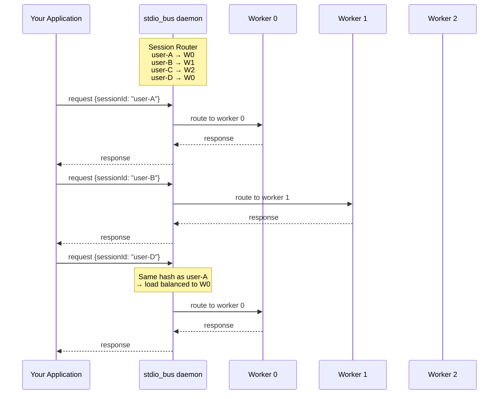

# [RFC] Scalable Multi-User Deployment: stdio_bus Protocol Integration

## Summary

This proposal introduces **stdio_bus protocol support** for Codex, enabling horizontal scaling and multi-user deployments through a standardized process orchestration layer.

## The Problem

Codex is designed as a single-user CLI tool. Each instance handles one user session. This works perfectly for individual developers, but creates significant challenges when deploying Codex as a service for multiple users.

### Current Deployment Options

**Option 1: One Process Per User**

```
User A → codex process A
User B → codex process B
User C → codex process C
...
User N → codex process N
```

Problems:
- Memory overhead: each process loads the full runtime (~100MB+ per instance)
- No resource sharing between instances
- Process management becomes complex at scale
- No built-in crash recovery or health monitoring

**Option 2: WebSocket Server Mode**

Codex supports `--listen ws://0.0.0.0:PORT`, but:
- Still one server instance per deployment
- No built-in load balancing
- No session affinity guarantees
- Scaling requires external orchestration (nginx, HAProxy, etc.)

**Option 3: Build Custom Orchestration**

You could build your own process manager, but you'd need to implement:
- Process spawning and lifecycle management
- Session-to-process routing (affinity)
- Crash detection and automatic restart with backoff
- Load balancing for new sessions
- Graceful shutdown with request draining
- Health monitoring and metrics

This is significant engineering effort, and every team deploying Codex at scale would need to solve the same problems independently.

## The Solution: stdio_bus Protocol

**stdio_bus** is a lightweight process orchestration protocol that solves exactly this problem. It manages a pool of worker processes, routes requests based on session affinity, and handles all the operational concerns automatically.

### How It Works



### Key Features

| Feature | Description |
|---------|-------------|
| **Session Affinity** | Requests with the same `sessionId` always route to the same worker |
| **Load Balancing** | New sessions distributed across workers (round-robin) |
| **Auto-Restart** | Crashed workers automatically restarted with exponential backoff |
| **Graceful Shutdown** | SIGTERM triggers drain period before termination |
| **Resource Limits** | Configurable buffer sizes and restart policies |
| **Transport Options** | TCP, Unix socket, or stdio |

### Protocol

Communication uses **NDJSON** (newline-delimited JSON) over stdio:

```
Client → stdio_bus:
{"jsonrpc":"2.0","method":"initialize","id":1,"sessionId":"thread:user-123","params":{...}}

stdio_bus → Worker (based on sessionId routing):
{"jsonrpc":"2.0","method":"initialize","id":1,"sessionId":"thread:user-123","params":{...}}

Worker → stdio_bus:
{"jsonrpc":"2.0","id":1,"sessionId":"thread:user-123","result":{...}}

stdio_bus → Client:
{"jsonrpc":"2.0","id":1,"sessionId":"thread:user-123","result":{...}}
```

The `sessionId` field is the routing key. All messages with the same `sessionId` go to the same worker, preserving conversation state.

## Implementation

### Changes to Codex

1. **New `--worker` flag** for `codex-app-server`:
   - Reads NDJSON from stdin, writes to stdout
   - Preserves `sessionId` in all responses
   - Designed for stdio_bus orchestration

2. **New `codex-stdio-bus` crate**:
   - Protocol types and serialization
   - Worker trait for easy integration
   - Structured logging with session context

### Configuration Example

```json
{
  "pools": [{
    "id": "codex",
    "command": "/usr/local/bin/codex-app-server",
    "args": ["--worker"],
    "instances": 10,
    "env": {"RUST_LOG": "info"}
  }],
  "limits": {
    "max_restarts": 5,
    "restart_window_sec": 60,
    "drain_timeout_sec": 30
  },
  "routing": {
    "session_id_field": "sessionId",
    "default_pool": "codex"
  }
}
```

### Real-World Test Results

Tested with 5 concurrent users and 3 workers:

```
[INFO] stdio Bus kernel v0.1.0 starting
[INFO] Process manager created with 3 workers across 1 pools
[INFO] All 3 workers started successfully
[INFO] Listening on TCP 127.0.0.1:9999

[INFO] [session=thread:user-A] New session assigned to worker 0
[INFO] [session=thread:user-B] New session assigned to worker 1
[INFO] [session=thread:user-C] New session assigned to worker 2
[INFO] [session=thread:user-D] New session assigned to worker 0
[INFO] [session=thread:user-E] New session assigned to worker 1

[INFO] Routing response id=1 to client 1
[INFO] Routing response id=2 to client 1
... (20 requests total, all successful)
```

Session distribution:
- Worker 0: User A, User D
- Worker 1: User B, User E  
- Worker 2: User C

All subsequent requests from each user routed to their assigned worker (session affinity confirmed).

## Use Cases

### 1. Multi-Tenant SaaS

Deploy Codex as a service for multiple customers:

```python
# Your API server
@app.post("/chat")
async def chat(user_id: str, message: str):
    session_id = f"thread:{user_id}"
    response = await stdiobus.send({
        "method": "turn/start",
        "sessionId": session_id,
        "params": {"message": message}
    })
    return response
```

### 2. IDE Backend

Power multiple IDE instances from a shared Codex pool:

```
VS Code Instance 1 ─┐
VS Code Instance 2 ─┼─→ stdio_bus ─→ Codex worker pool
VS Code Instance 3 ─┘
```

### 3. CI/CD Integration

Run Codex tasks in parallel across a worker pool:

```yaml
# Each job gets its own session, routed to available worker
jobs:
  - codex exec "Review PR #123" --session pr-123
  - codex exec "Review PR #124" --session pr-124
  - codex exec "Review PR #125" --session pr-125
```

## Comparison

| Aspect | Without stdio_bus | With stdio_bus |
|--------|-------------------|----------------|
| Processes for 100 users | 100 | 5-10 workers |
| Memory usage | ~10GB | ~1GB |
| Session affinity | Manual | Built-in |
| Crash recovery | Manual | Automatic |
| Load balancing | Manual | Built-in |
| Scaling | Code changes | Config change |
| Graceful shutdown | Manual | Built-in |

## Questions for Discussion

1. **Default worker count**: Should there be a recommended ratio of workers to expected concurrent users?

2. **Session timeout**: Should stdio_bus support automatic session cleanup after inactivity?

3. **Metrics endpoint**: Would a `/metrics` endpoint for Prometheus integration be valuable?

4. **Alternative routing**: Beyond session affinity, are there use cases for content-based routing?

## Resources

- [stdio_bus Protocol Specification](https://github.com/stdiobus/stdiobus)
- [stdio_bus Protocol Documentation](https://stdiobus.com)
- [Docker Image](https://hub.docker.com/r/stdiobus/stdiobus)
- Implementation PR: ***

---

I'd love to hear feedback from the community on this approach. Is horizontal scaling a pain point you've encountered? Are there other deployment scenarios we should consider?
