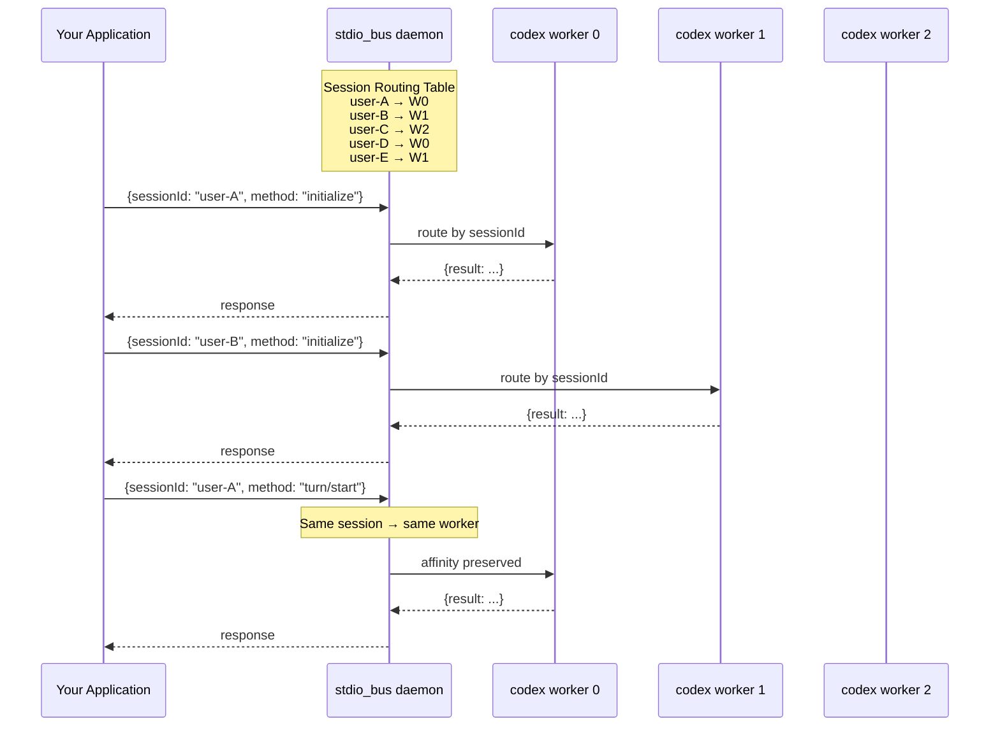

# Codex lacks horizontal scaling support for multi-user deployments

## Problem Statement

Codex is architected as a single-user tool. While this works perfectly for individual developers using the CLI, it creates fundamental limitations when deploying Codex as a backend service for multiple concurrent users.

## The Problem in Detail

### 1. One Process = One User

Currently, each Codex instance (whether CLI, TUI, or app-server) handles exactly one user session. The app-server maintains conversation state, tool execution context, and model interaction history in memory. There is no mechanism to share a single process across multiple users.

**Impact**: To serve N users, you need N processes.

### 2. No Session Affinity Mechanism

Codex conversations are stateful. A user's second message depends on context from their first message. If you try to load-balance requests across multiple Codex instances, you break this statefulness.

**Impact**: You cannot use standard load balancers (nginx, HAProxy, k8s services) without implementing sticky sessions yourself.

### 3. No Built-in Process Pool Management

There is no way to say "run 10 Codex workers and distribute users across them." Each instance must be started, monitored, and restarted independently.

**Impact**: Operators must build custom orchestration for:
- Process spawning and lifecycle
- Health monitoring
- Crash detection and restart
- Graceful shutdown coordination

### 4. Memory Overhead at Scale

Each Codex process loads the full runtime. For 100 concurrent users:
- 100 separate processes
- ~100MB+ memory per process  
- ~10GB+ total memory just for process overhead

**Impact**: Inefficient resource utilization, high infrastructure costs.


### 5. No Standardized Worker Protocol

The app-server supports `stdio://` and `ws://` transports, but neither is designed for orchestration:
- `stdio://` assumes direct terminal attachment
- `ws://` is a server, not a managed worker

There is no "worker mode" where Codex can be spawned and managed by an external process supervisor with proper request routing.

**Impact**: Cannot integrate with process orchestration systems.

### 6. Crash Recovery is Manual

If a Codex process crashes mid-conversation, the user's session is lost. There is no automatic restart, no backoff strategy, no way to limit restart attempts.

**Impact**: Poor reliability for production deployments.

## Real-World Scenarios Affected

| Scenario | Current Limitation |
|----------|-------------------|
| **SaaS Platform** | Cannot efficiently serve multiple customers from shared infrastructure |
| **IDE Backend** | Each IDE instance needs dedicated Codex process |
| **CI/CD Pipeline** | Parallel Codex tasks require parallel processes |
| **Team Server** | No way to share Codex capacity across team members |
| **API Service** | Must over-provision or accept cold-start latency |

## Current Workarounds (All Inadequate)

**Workaround 1**: Spawn process per request
- High latency (process startup time)
- No conversation continuity
- Resource waste

**Workaround 2**: Long-running process per user
- Memory overhead
- No sharing of idle capacity
- Complex lifecycle management

**Workaround 3**: Custom orchestration layer
- Significant engineering effort
- Every deployer solves same problems
- No standardization

---

## Proposed Solution: stdio_bus Protocol Integration

I've implemented support for the **stdio_bus protocol** — a lightweight process orchestration standard designed exactly for this use case.

### What is stdio_bus?

stdio_bus is a daemon that manages a pool of worker processes, routes requests based on session affinity, and handles all operational concerns (restart, backoff, drain, monitoring).

Protocol: NDJSON over stdio with `sessionId` field for routing.


### How It Solves Each Problem

| Problem | stdio_bus Solution |
|---------|-------------------|
| One process per user | Worker pool serves many users |
| No session affinity | Built-in routing by `sessionId` |
| No pool management | Daemon manages worker lifecycle |
| Memory overhead | N workers serve M users (N << M) |
| No worker protocol | `--worker` mode with NDJSON/stdio |
| Manual crash recovery | Auto-restart with exponential backoff |

### Architecture



### Implementation

My fork adds:

1. **`--worker` flag** for `codex-app-server`
   - NDJSON input/output via stdio
   - Preserves `sessionId` in responses
   - Clean shutdown on stdin EOF

2. **`codex-stdio-bus` crate**
   - Protocol types (`StdioBusRequest`, `StdioBusResponse`)
   - Worker abstraction
   - Structured logging with session context

3. **Documentation and examples**
   - Multi-user service example with FastAPI
   - Integration tests
   - Migration guide

### Tested Results

5 concurrent users, 3 workers:

```
[INFO] [session=user-A] New session assigned to worker 0
[INFO] [session=user-B] New session assigned to worker 1
[INFO] [session=user-C] New session assigned to worker 2
[INFO] [session=user-D] New session assigned to worker 0
[INFO] [session=user-E] New session assigned to worker 1
```

All 20 requests routed correctly with session affinity preserved.

## Links

- **Implementation**: ***
- **stdio_bus Protocol**: 
  - GitHub: https://github.com/stdiobus/stdiobus
  - Documentation: https://stdiobus.com
- **Docker Image**: https://hub.docker.com/r/stdiobus/stdiobus

## Request

I'd like feedback on this approach before submitting a PR. Specifically:

1. Is horizontal scaling a priority for the Codex roadmap?
2. Is stdio_bus the right abstraction, or would you prefer a different approach?
3. Are there concerns about adding this dependency/protocol?

Happy to discuss and iterate on the implementation.
